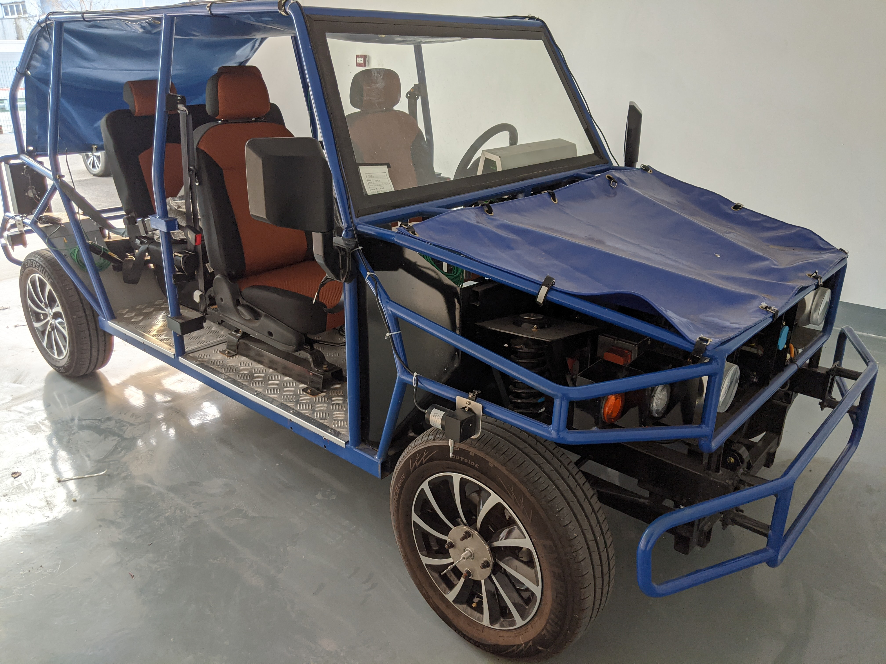
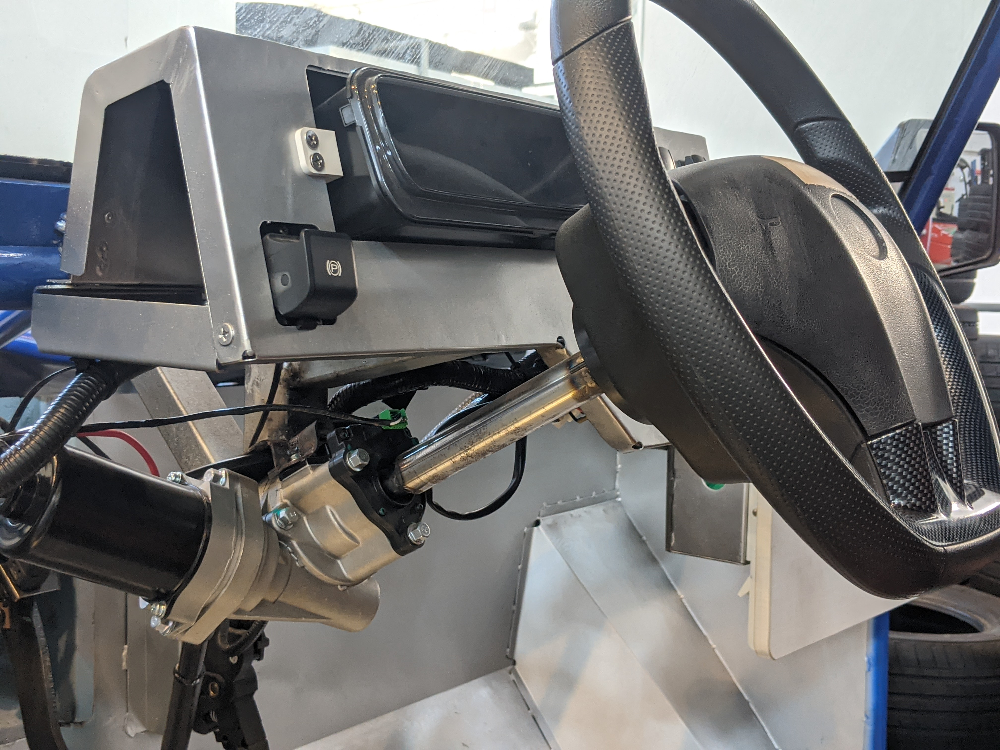

# BLUE

## overview

## EPS Specification

| **Item**       | **Parameters** |
| -------------- | -------------- |
| Gear Ratio     | 16.5 : 1       |
| Torque without load (N.m) | 1.2 +/- 0.3    |
| Temperature (Deg C) | -40-85    |
| Rated Power (W) | 220            |
| Rated Voltage (V) | DC 12          |
| Rated Current (A) | 40 +/- 10%    |
| Rated Revolution (rpm) | 1050 +/- 150 |
| Revolution without load (rpm) | 2000 +/- 10% |
| Insulation voltage (V) | 500            |
| Rated working time (min) | 2 |

