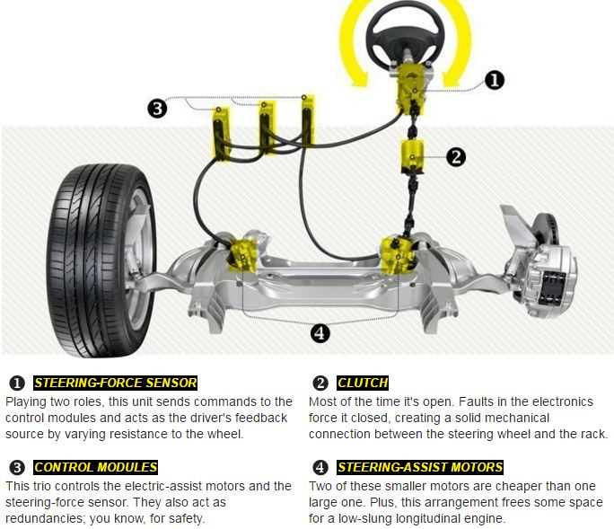
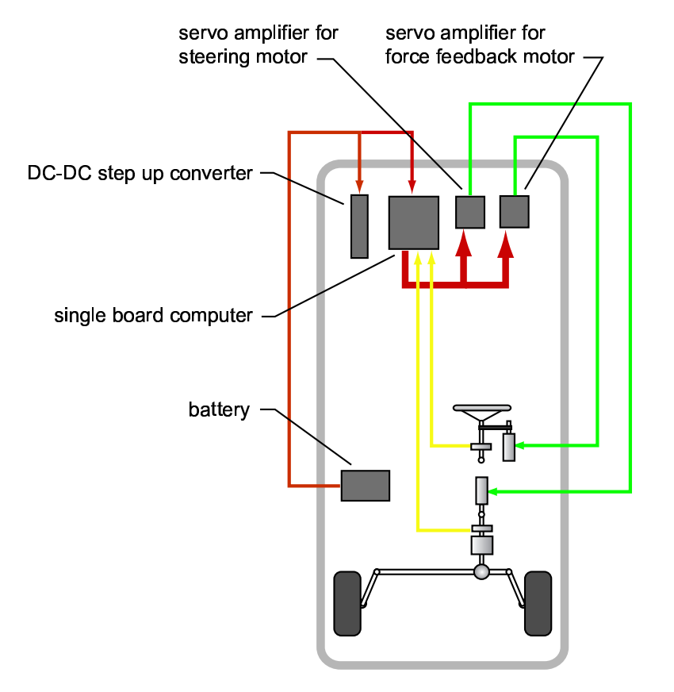

# BLUE_hardware
## Objective目标

Convert our testbed vehicle into an simplified [Nissan Infiniti Q50](https://www.caranddriver.com/features/a15116750/electric-feel-nissan-digitizes-steering-but-the-wheel-remains-feature/)-style steer-by-wire (SBW) system.

To learn more about our [BLUE testbed](BLUE_testbed.md).

将我们的试验台车转换为简化的[日产英菲尼迪Q50](https://www.caranddriver.com/features/a15116750/electric-feel-nissan-digitizes-steering-but-the-wheel-remains-feature/)式线控转向系统。

要了解更多关于我们的[BLUE测试平台](BLUE_testbed.md)。

The Q50 SBW system consist of,

Q50 SBW系统包括：

1. Steering-Force Sensor转向力传感器

   Playing two roles, this unit sends commands to the control modules and acts as the driver's feedback source by varying resistance to the wheel.

   发挥两个作用，该单元向控制模块发送指令，并通过改变方向盘的阻力作为驾驶员的反馈源。

2. Clutch离合器

   The fail-safe clutch in its column. In ­normal driving situations, this clutch is disengaged, but if one of the three control modules detects a fault, the clutch snaps shut and the steering acts as a conventional, electrically assisted rack-and-pinion system. The clutch also engages when the engine shuts off, so if one of the first SBW-equipped cars fails to start, the owner can still steer the car while pushing it.

   转向柱中的故障安全离合器。在正常行驶的情况下，这个离合器是脱开的，但如果三个控制模块中的一个模块检测到故障，离合器就会扣合，转向器就会像传统的电动助力齿轮齿条系统一样。当发动机关闭时，离合器也会啮合，因此，如果首批装备SBW的汽车中有一辆汽车无法启动，车主仍然可以在推动汽车的同时进行转向。

3. Control Modules控制模块

   This trio controls the electric-assist motors and the steering-force sensor. They also act as redundancies.

   这三个部件控制电动辅助电机和转向力传感器。它们也起到了冗余的作用。

4. Steering-Assist Motors转向辅助电机

   Two of these smaller motors are cheaper than one large one. Plus, this arrangement frees some space for a low-slung longitudinal engine.

   两台这样的小型电机比一台大电机便宜。另外，这种安排为低垂的纵向发动机腾出了一些空间。

## Principle

### Diagram

|  |      |
| ---------------------------------------------------- | ---- |
| Stanford's SBW [1]                                   | Ours |

## Hardware

| Q50 SBW                   | Ours                                                     | Description               |              |
| ------------------------- | -------------------------------------------------------- | ------------------------- | ------------ |
| 1. Steering-Force Sensor  | angle sensor +                                           |                           |              |
| 2. Clutch                 | Undetermined                                             |                           |              |
| 3. Control Modules        | [Audesse FlexCase](https://www.audesseinc.com/labs/) * 3 |                           |              |
| 4. Steering-Assist Motors | DC motor + * 2                                           | * rated power  100W       | 68.00 CNY@1  |
|                           | Amplifier * 2                                            | 12V 30A DC motor H-bridge | 132.00 CNY@1 |
### Steering-Assist Motors

#### Determination of motor's torque

[12V DC Motor](https://item.taobao.com/item.htm?spm=a1z0d.6639537.1997196601.26.6a6d7484zwU5ho&id=626451109695)

**Q: How to determine motor torque?**

A: See [Motor Calculations for Coreless Brush DC Motors](https://www.faulhaber.com/en/support/technical-support/motors/tutorials/dc-motor-tutorial-dc-motor-calculation/)

### 

#### Choose the right amplifier

[Midesigner 30A H-bridge](https://item.taobao.com/item.htm?spm=a1z0d.6639537.1997196601.297.4c947484OsRlGs&id=629440689350)

**Q: What is a H-bridge?**

A: See [Arduino DC Motor Control Tutorial](https://howtomechatronics.com/tutorials/arduino/arduino-dc-motor-control-tutorial-l298n-pwm-h-bridge/)

### Consideration of force feedback

**Q: What is a TFD?**

A: See [Lord's Tactile Feedback Device(TFD)](https://www.lord.com/products-and-solutions/steer-by-wire-tactile-feedback-device), and [how](http://files.lord.com/pdf/44/PB8130_TFDBrochure.pdf)

The TFD steering unit is a key component of fully-electric and electro-hydraulic SbW systems. These devices provide an integrated solution that combines bearing support, steering position sensing, communication and continuously variable resistive steering torque, all to deliver high-fidelity tactile feedback and maximum control to the operator.

TFD转向装置是全电动和电液式SbW系统的关键部件。这些装置提供了一个集成的解决方案，将轴承支撑、转向位置传感、通信和连续可变的电阻式转向扭矩结合在一起，所有这些都能为操作者提供高保真的触觉反馈和最大的控制。

### Modification of steering rack

## Reference
1. Yih, Paul. [*Steer-by-wire: Implications for vehicle handling and safety.*](https://github.com/jayhsu0627/BLUE_hardware/blob/main/reference/1_STEER-BY-WIRE%20IMPLICATIONS%20FOR%20VEHICLE%20HANDLING%20AND%20SAFETY_dissertation.pdf) (2005): 6021-6021.
2. Gadda, Christopher David. [*Optimal fault-detection filter design for steer-by-wire vehicles*](https://github.com/jayhsu0627/BLUE_hardware/blob/main/reference/2_2008_Thesis_Gadda_Optimal_Fault_Detection_Filter_Design_for_SBW_Vehicles.pdf). Stanford University, 2009.
3. Gadda, Christopher D. [Incorporating a Model of Vehicle Dynamics in a Diagnostic System for Steer-By-Wire Vehicles, Dept. of Mechanical Engineering.](https://github.com/jayhsu0627/BLUE_hardware/blob/main/reference/3_avec04.pdf) 94305-4021.

